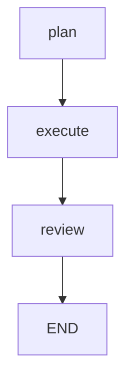

A compiled graph knows its own shape, and Cognis can serialize that shape to three formats. Use this when you want a doc artifact, a debugging aid, or a quick mental check that the topology you built is the topology you wanted.

## Three formats

```rust
use cognis::prelude::*;

// (build a graph as usual…)
let g = builder.compile()?;

println!("{}", g.to_dot());      // GraphViz
println!("{}", g.to_mermaid());  // Mermaid
println!("{}", g.to_ascii());    // ASCII
```

| Format | Use for |
|---|---|
| `to_dot()` | Pipe through `dot -Tsvg > graph.svg` or paste into any GraphViz viewer. Best fidelity. |
| `to_mermaid()` | Drop into Markdown — GitHub, Notion, mintlify all render it natively. |
| `to_ascii()` | Quick terminal check, log artifact, no external tooling. |

## Quick example

```rust
use cognis::prelude::*;

#[derive(Default, Clone)]
struct S;
impl GraphState for S {
    type Update = ();
    fn apply(&mut self, _: ()) {}
}

#[tokio::main]
async fn main() -> Result<()> {
    let plan = node_fn::<S, _, _>("plan", |_, _| async {
        Ok(NodeOut { update: (), goto: Goto::node("execute") })
    });
    let execute = node_fn::<S, _, _>("execute", |_, _| async {
        Ok(NodeOut { update: (), goto: Goto::node("review") })
    });
    let review = node_fn::<S, _, _>("review", |_, _| async {
        Ok(NodeOut { update: (), goto: Goto::end() })
    });

    let g = Graph::<S>::new()
        .node("plan", plan)
        .node("execute", execute)
        .node("review", review)
        .edge("plan", "execute")
        .edge("execute", "review")
        .start_at("plan")
        .compile()?;

    println!("{}", g.to_mermaid());
    Ok(())
}
```

Source: [`examples/graphs/graph_dot_export.rs`](https://github.com/0xvasanth/cognis/blob/main/examples/graphs/graph_dot_export.rs).

## What appears in the rendering

- **Nodes** — by name. Start node and end terminal are highlighted.
- **Static edges** — declared via `.edge(from, to)`.
- **Dynamic edges** — inferred from `Goto::node` targets reachable in the topology.
- **Subgraphs** — nested cluster (DOT) or subgraph block (Mermaid).

Edges that depend on state at runtime (e.g., `Goto::node` chosen in a node body) appear as candidate edges — the renderer can't know which one fires until execution time.

## Embedding in docs

For repo READMEs and mintlify pages, Mermaid is friction-free:

````md

````

Generate the block from your test setup:

```rust
#[test]
fn graph_topology_doc() {
    let g = my_app::build_graph().compile().unwrap();
    insta::assert_snapshot!(g.to_mermaid());
}
```

Snapshot the rendered string in tests so PRs that change the graph also update the picture.

## How it works

- **Rendering walks the compiled graph's internal topology.** No state involved — purely structural.
- **Dynamic gotos can't be statically resolved.** Renderers conservatively show all reachable targets.
- **Mermaid uses `flowchart TD` by default** — top-down. Use `to_mermaid_with_direction(Direction::Lr)` for left-right when you need horizontal layouts (where supported).

## See also

<CardGroup cols={2}>
  <Card title="Control flow" icon="arrow-up-right-from-square" href="/graph-workflows/control-flow">
    What you're visualizing.
  </Card>
  <Card title="Streaming" icon="signal" href="/graph-workflows/streaming">
    Watch the graph execute.
  </Card>
</CardGroup>
